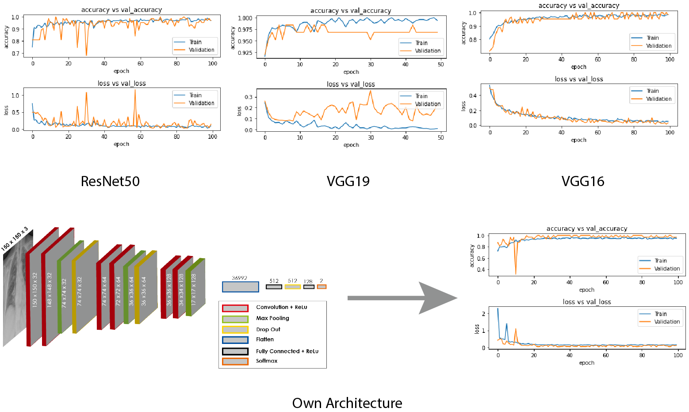
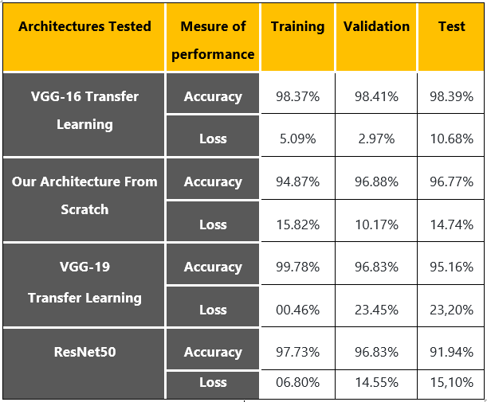

# COVID-19 Detection From X-ray Images Using Deep Learning 
Our project aims to create a solution that can easily detect covid-19 in an automated way, especially when The need for auxiliary diagnostic tools has increased as there are no accurate automated toolkits available. So, we're going to use Transfer Learning with advanced and popular architectures like VGG16, VGG19, ResNet50 and trying out SIAMESE with pre-trained weights on the popular ImageNet dataset. This implementation use Keras with a TensorFlow backend, and it will be performed Then adapted to our dataset which is full of X-ray images in Covid-19 and No_findings folders.

## Table of contents
- [Tec Stack](#tech-stacks)
- [Data Set Description](#data-set-description)
- [Models Tested](#models-tested)
- [Results](#results)
- [Authors Infos](#authors-infos)

---
### Tech Stacks
* [x] Python
* [x] Keras/TensorFlow

---

### Data Set Description
Recent findings obtained using X-ray imaging techniques suggest that these images contain important information about the COVID-19 virus. The application of advanced artificial intelligence (AI) techniques coupled with X-ray imaging can be useful for the precise detection of this virus and can also help overcome the problem of the lack of specialist doctors in remote villages. Therefore, we will use a Dataset containing two classes, the first contains x-ray images of infected people and the second contains x-ray images of non-contaminated people as shown in the table below:
<table>
  <thead>
     <tr><th> COVID-19 </th> <th> NO-Findings </th></tr>
  </thead>
  <tr>
    <td>125 IMAGE</td>
    <td>500 IMAGE</td>
  </tr>
</table>
 
---
### Models Tested
 - VGG16
 - VGG19
 - ResNet50
 - SAIMESE (ERROR)
 - Our Own Architecture: 

---
### Results
 - **Performance graphse:**

 - **Comparative table:** 

---
### Authors Infos
- LinkedIn: [Nour Eddine ZEKAOUI](https://www.linkedin.com/in/nour-eddine-zekaoui-ba43b1177/)
- Twitter: [@NZekaoui](https://twitter.com/NZekaoui)
---
 
[Back To The Top](#covid-19-detection-from-x-ray-images-using-deep-learning)
 
